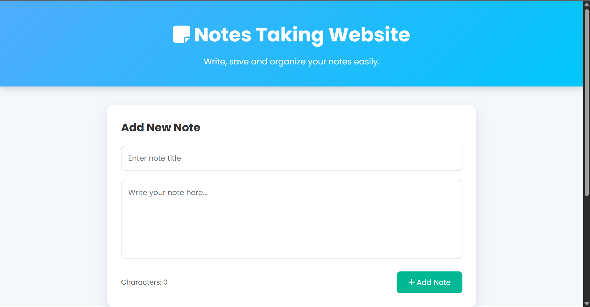
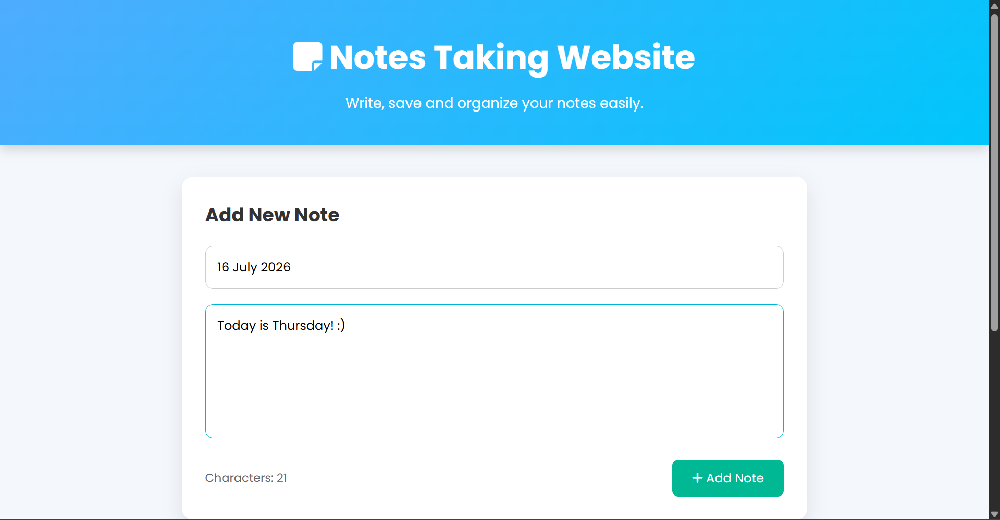
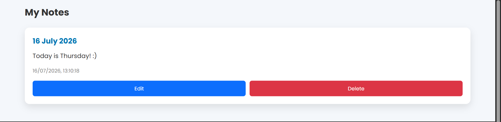
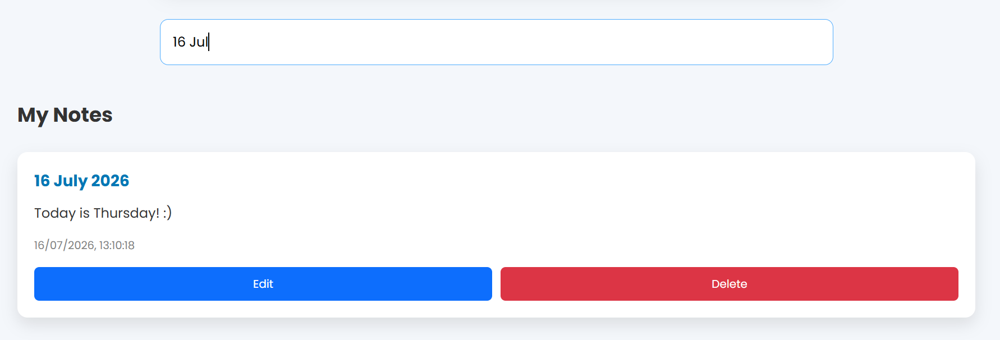
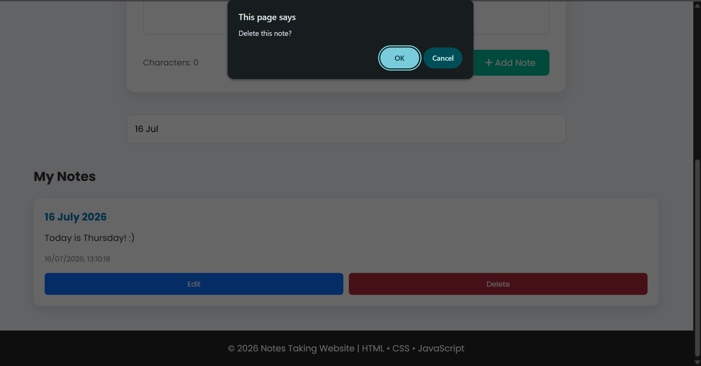

# 📝 Notes Taking Website

A responsive Notes Taking Website built using **HTML, CSS, and JavaScript**. This application allows users to create, edit, search, and delete notes while storing all data in the browser using Local Storage.

---

## ✨ Features

- ➕ Add new notes
- 📝 Edit existing notes
- 🗑️ Delete notes
- 🔍 Search notes instantly
- 💾 Save notes using Local Storage
- 📅 Display date and time for each note
- 🔢 Character counter
- 📱 Responsive design
- 🎨 Clean and modern user interface

---

## 🛠️ Technologies Used

- HTML
- CSS
- JavaScript
- Local Storage API

---

## 📖 How It Works

- Users can create notes by entering a title and description.
- Notes are saved in the browser using Local Storage.
- Saved notes remain available even after refreshing the page.
- Users can edit, delete, and search notes easily.

---

## 📸 Screenshots

### Homepage

### Add Note

### Saved Notes

### Search Notes

### Delete Note

---

## 📚 Learning Outcomes

This project helped me practice:

- HTML structure
- CSS styling
- Responsive web design
- JavaScript DOM Manipulation
- Event Handling
- Local Storage
- CRUD Operations

---

## 🚀 Future Improvements

- Note categories
- Dark mode
- Pin important notes
- Export notes
- Rich text editor

---

## 👩‍💻 Author

**Hajra Bashir**

If you like this project, consider giving it a ⭐!
